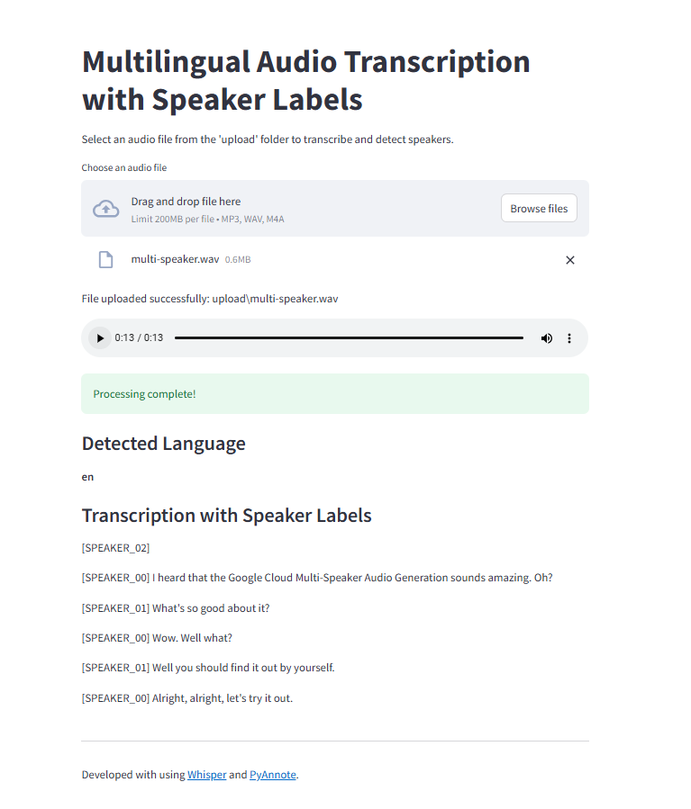

# Multilingual Audio Transcription and Speaker Diarization

This project is a Streamlit application that uses OpenAI's Whisper model for multilingual speech-to-text transcription and the PyAnnote library for speaker diarization. Users can upload an audio file, and the app will transcribe the audio, detect the language, and label the transcription with speaker labels.



## Features

- **Multilingual Transcription**: Automatically transcribes audio in various languages using OpenAI’s Whisper model.
- **Speaker Diarization**: Detects different speakers in the audio and labels the transcription accordingly.
- **File Upload**: Allows users to upload an audio file, which is then processed for transcription and speaker diarization.
- **Timestamped File Naming**: Uploaded files are saved with a unique timestamp in the filename.

## Requirements

Make sure to have the following Python libraries installed. You can install them using `pip` and the `requirements.txt` file provided.

### Installation

1. Clone the repository:
   ```bash
   git clone https://github.com/your-repository-url.git
   cd your-repository
   ```

2. Create and activate a virtual environment (optional but recommended):
   ```bash
   python -m venv env
   source env/bin/activate  # On Windows, use `env\Scripts\activate`
   ```

3. Install the dependencies:
   ```bash
   pip install -r requirements.txt
   ```

4. Install Hugging Face authentication token for pyannote audio (if required):
   - Create an account on Hugging Face (https://huggingface.co/).
   - Obtain an API token from your account.
   - Use the token in your app by setting it as an environment variable or directly in the code:
     ```python
     use_auth_token="your_token"
     ```

## Usage

1. Run the Streamlit app:
   ```bash
   streamlit run app.py
   ```

2. The app will launch in your browser. Select an audio file (MP3, WAV, or M4A format) from your system.

3. The file will be uploaded to the `upload` directory, and the transcription will begin.

4. After processing, the app will display:
   - The detected language of the audio.
   - The transcription with speaker labels.

## Models

### Whisper Model
- Used for multilingual transcription.
- The model is loaded using the `whisper` Python package.

### PyAnnote Model
- Used for speaker diarization to detect speakers in the audio.
- The model is loaded using the `pyannote.audio` library.

## Troubleshooting

### Diarization Model Issues
If you face issues with loading the diarization model, ensure you have:
- Installed the correct dependencies.
- Set up the Hugging Face token if required.

### Model Load Failures
If the models fail to load, ensure that:
- The internet connection is stable.
- The model files are downloaded correctly.

### File Upload Issues
If the file upload is not working correctly:
- Ensure the `upload` folder exists in your project directory.
- Make sure the file path is correct and accessible.
